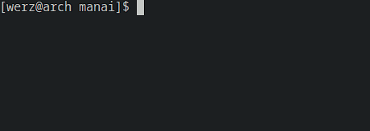

# RUST OpenAI CLI

A Command-Line Interface (CLI) written in Rust that interacts with the OpenAI API for generating AI responses. This CLI allows you to have interactive conversations with an AI model powered by OpenAI's GPT-3.5 Turbo.

## Prerequisites

Before using this CLI, make sure you have the following:

-   Rust programming language and Cargo package manager installed
-   OpenAI API key (sign up at [OpenAI](https://openai.com/) to get an API key)

## Installation

To use this CLI, follow these steps:

1. Clone the repository:

    ```shell
    git clone https://github.com/0xwerz/manai.git
    ```

2. Change directory to the repository:

    ```shell
    cd manai
    ```

3. Build the CLI using Cargo:

    ```shell
    cargo build --release
    ```

## Configuration

The CLI requires your OpenAI API key to function. You can either set the API key as an environment variable or provide it interactively when prompted.

### Setting API Key as an Environment Variable

Create a file named `.env` in the project directory and add the following line, replacing `YOUR_API_KEY` with your actual API key:

```shell
OPENAI_API_KEY=YOUR_API_KEY
```

### Providing API Key Interactively

If the API key is not set as an environment variable, the CLI will prompt you to enter the API key when you run it for the first time. The API key will be saved in the .env file for future use.

## Usage

The CLI provides two modes of operation: interactive mode and single prompt mode.

### Interactive Mode

To start the interactive mode, run the following command:

```shell
manai --interactive
```

In interactive mode, the CLI will continuously prompt you for input and provide AI-generated responses. Enter your `prompt` after the Prompt: message, and the `AI` response will be displayed as AI:.

To exit the interactive mode, press Ctrl + C.

### Single Prompt Mode

To generate a single AI response for a specific prompt, run the following command:

```shell
manai <Your prompt goes here>
```

Replace `<Your prompt goes here>` with the prompt you want to use. The AI response will be displayed in the console.

## Example

Here's an example of using the CLI in single prompt mode:


